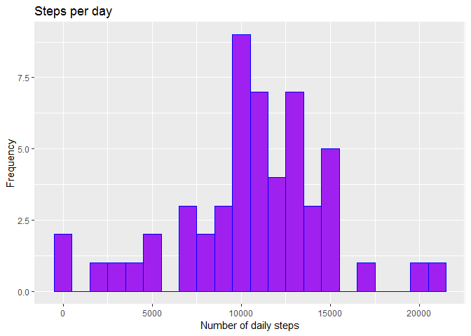
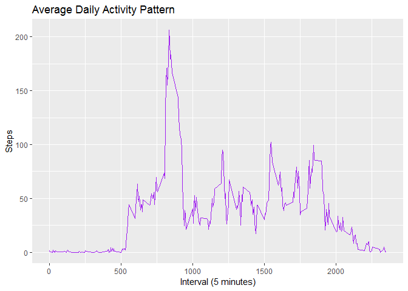
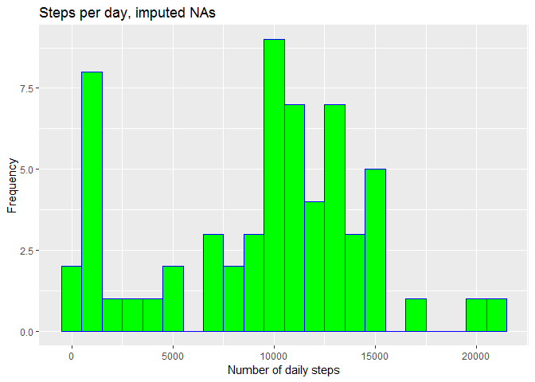
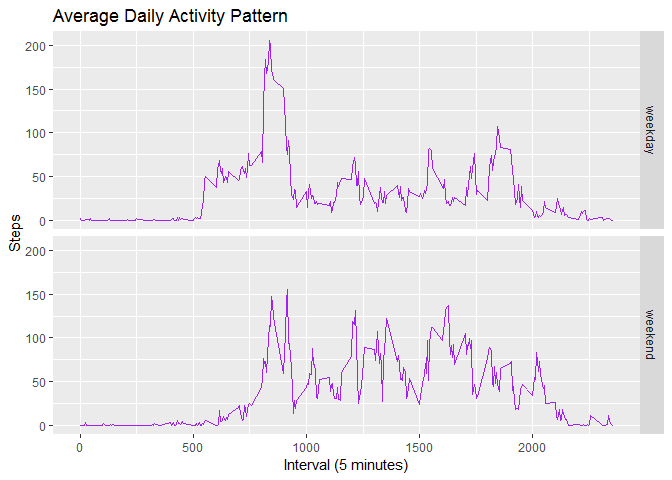

## Loading and preprocessing the data

```r
rawData <- read.csv(unz("activity.zip", "activity.csv"), header = TRUE, stringsAsFactors = FALSE)
head(rawData)
```

```
##   steps       date interval
## 1    NA 2012-10-01        0
## 2    NA 2012-10-01        5
## 3    NA 2012-10-01       10
## 4    NA 2012-10-01       15
## 5    NA 2012-10-01       20
## 6    NA 2012-10-01       25
```

```r
data <- rawData
data[,1] <- as.numeric(data[,1])
data$date <- as.Date(data$date, "%Y-%m-%d")
```
## What is mean total number of steps taken per day?

```r
#Calculate the total number of steps taken per day
dateCol <- unique(data$date)
stepCol <- integer()
i <- 1
for (d in dateCol){
  #print(paste("The year is", d))
  subs <- data[(data$date==d),]
  stepCol[i] <- sum(subs$steps, na.rm = FALSE)
  i <- i + 1
}
dailySteps <- cbind.data.frame(dateCol,stepCol)
dailySteps <- setNames(dailySteps, c("date", "steps"))
head(dailySteps)
```

```
##         date steps
## 1 2012-10-01    NA
## 2 2012-10-02   126
## 3 2012-10-03 11352
## 4 2012-10-04 12116
## 5 2012-10-05 13294
## 6 2012-10-06 15420
```

```r
#Make a histogram of the total number of steps taken each day
library(ggplot2)
```

```
## Warning: package 'ggplot2' was built under R version 3.5.3
```

```r
ggplot(dailySteps, aes(dailySteps$steps)) + geom_histogram(na.rm=FALSE, binwidth = 1000, color="blue", fill="purple") +
  xlab("Number of daily steps") + ylab("Frequency") +
  ggtitle("Steps per day")
```

```
## Warning: Removed 8 rows containing non-finite values (stat_bin).
```

<!-- -->
## Mean and median of the total number of steps taken per day

```r
meanSteps <- mean(dailySteps$steps, na.rm = TRUE)
medianSteps <- median(dailySteps$steps, na.rm = TRUE)
```

```
## [1] "Mean number of steps per day: 10766.19"
```

```
## [1] "Median number of steps per day: 10765"
```

## What is the average daily activity pattern?

```r
timeIntervalAvgSteps <- aggregate( list(meanNumberSteps = data$steps), by = list(interval = data$interval), mean, na.rm = TRUE)

ggplot(timeIntervalAvgSteps, aes(interval, meanNumberSteps)) +
    geom_line(color="purple") +
    ggtitle("Average Daily Activity Pattern") +
    xlab("Interval (5 minutes)") +
    ylab("Steps")
```

<!-- -->

```r
pos_max <- which.max(timeIntervalAvgSteps$meanNumberSteps)

maxAvgStepsInterval <- timeIntervalAvgSteps$interval[pos_max]
paste("The 5 minute time interval with the maximum number of average steps:", maxAvgStepsInterval)
```

```
## [1] "The 5 minute time interval with the maximum number of average steps: 835"
```

## Imputing missing values

```r
isRowNA <- apply(data, MARGIN = 1, function(x) sum(is.na(x)))
totalNA <- sum(isRowNA)
paste("Number of rows containing NA values:", totalNA)
```

```
## [1] "Number of rows containing NA values: 2304"
```

# Replace NAs with the median value for the given time interval

```r
timeIntervalMedianSteps <- aggregate( list(medianNumberSteps = data$steps), by = list(interval = data$interval), median, na.rm = TRUE)
cleanDF <- data                 #new data frame. NA values will be replaced
naRows <- is.na(cleanDF$steps)  #identify current NA rows

for (i in 1:length(naRows)){    #replace NA value
  if (naRows[i] == TRUE){       #if NA row, replace steps value with the median number of steps for the given time interval
    currentRow <- cleanDF[i,]
    timeIntRow <- timeIntervalMedianSteps[(timeIntervalMedianSteps$interval == currentRow$interval),]
    cleanDF$steps[i] <- timeIntRow$medianNumberSteps
  }
  i <- i + 1
}
```
# Histogram: total number of steps taken each day

```r
dateCol2 <- unique(cleanDF$date)
stepCol2 <- integer()
n <- 1
for (d in dateCol2){
  subs2 <- cleanDF[(cleanDF$date==d),]
  stepCol2[n] <- sum(subs2$steps)
  n <- n + 1
}
dailySteps2 <- cbind.data.frame(dateCol2,stepCol2)
dailySteps2 <- setNames(dailySteps2, c("date", "steps"))

ggplot(dailySteps2, aes(steps)) + geom_histogram(binwidth = 1000, color="blue", fill="green") +
  xlab("Number of daily steps") + ylab("Frequency") +
  ggtitle("Steps per day, imputed NAs")
```

<!-- -->

```r
meanSteps2 <- mean(dailySteps2$steps)
medianSteps2 <- median(dailySteps2$steps)
```

```
## [1] "Mean number of steps per day, with NAs: 10766.19"
```

```
## [1] "Mean number of steps per day, without NAs: 9503.87"
```

```
## [1] "Median number of steps per day, with NAs: 10765"
```

```
## [1] "Median number of steps per day, without NAs: 10765"
```

## Are there differences in activity patterns between weekdays and weekends?

```r
act <- cleanDF
act$weekdayFactor <- ifelse(as.POSIXlt(cleanDF$date)$wday %in% c(0,6), 'weekend', 'weekday')

timeIntervalAvgSteps2 <- aggregate(steps ~ interval + weekdayFactor, act, mean)

ggplot(timeIntervalAvgSteps2, aes(interval, steps)) +
    geom_line(color="purple") +
    facet_grid(weekdayFactor ~ .) +
    ggtitle("Average Daily Activity Pattern") +
    xlab("Interval (5 minutes)") +
    ylab("Steps")
```

<!-- -->
